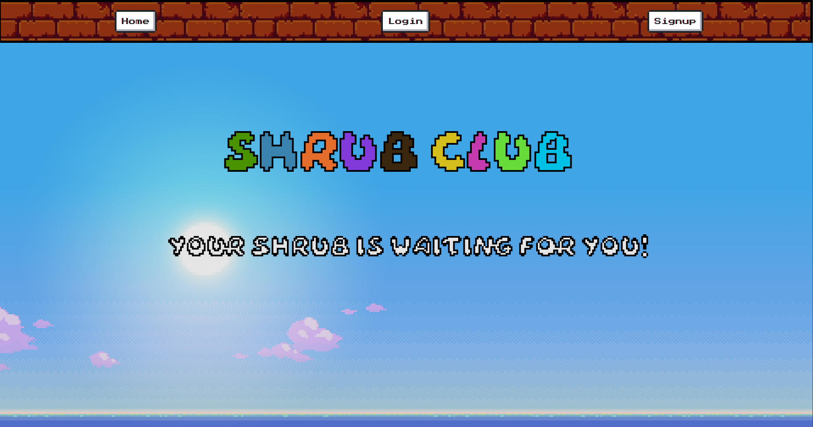

# shrub-club

## Description 

Shrub Club is an app that is similar to Tamagochi.

The user has a "Shrub" that they can take care of by feeding, cleaning, chatting, and more. 

The distinct difference between Shrub-Club and other games (such as tamagochi, nintendogs, neopets, princess maker, etc.) is that you can interact with your shrub with verbal sentences.

When you speak a sentence or words to the shrub and send it, it calculates a reaction to the mood and applies it to the shrub's happiness.

## UserStory 

```md
AS A user who wants to know the impact of words to people's emotions
I WANT to show how negative and positive words influence others by playing game
SO THAT people can visually see the result according to the word that they are speaking

```

## Acceptance Criteria

```md
GIVEN I enter the website 
THEN I can see options to log in, signup, and landing page
WHEN I sign in 
THEN I can see my Shrub with the stats bar, have access to games, a section to interact with shrub, and the option to log out
WHEN I click "Shrubble"
THEN I can play boggle game and earn game currency
WHEN I click "Home" 
THEN It goes back to the Shrub page
WHEN I click "Store" on the homepage
THEN I can see the loot box that I can open with the game currency
WHEN I click "open box" on the store page
THEN I can get random Items that I can decorate my Shrub 
WHEN I click "Customize" on the homepage 
THEN I can change the Shrub outfit
WHEN I click "save" on the customize page 
THEN It saves the current outfit
WHEN I go back to the Homepage
THEN I can see the shrub with the new outfit
WHEN I click "chat" on the homepage 
THEN I can see the Shrub and the mic button to interact with Shrub 
WHEN I click "mic" on the chat page 
THEN It captures the voice with the user's mic
WHEN I send my voice (sentence & word) to the server on chat page
THEN It calculates the happiness of the shrub and updates the shrub info 
WHEN I go back to the homepage 
THEN I can see the stats bar changed according to the action that I've done with my shrub
WHEN I click the "clean, sleep, feed" button on the Homepage 
THEN Shrub's stats change (clean: hygiene, sleep: energy, watering: hunger)
WHEN I click "logout" 
THEN I go back to the landing page
```

## Installation 

```md
bootstrap
natural
nes.css
react
```

## Usage 

npm i --> then you can start the server with npm run start.


In this website you can create your own account, quizzes and profile that save in the database.


All of this databases are interacting eachother and with this relationship we generated handlebar pages.

## APP Screen Shot 



## Credits 

This project was created by Jordan Johnson, Sangmi Yun, and David Kovalchuk.

The APIs that we used are:

- [Web Speech API] (https://developer.mozilla.org/en-US/docs/Web/API/Web_Speech_API)

- [natural] 

- [Dictionary API]


## Deployed Application 

https://shrubclub.netlify.app/ 

## License 

MIT 

## Contact 

https://github.com/itsDavidK

https://github.com/jordan-koichiro-johnson

https://github.com/MiaYun98